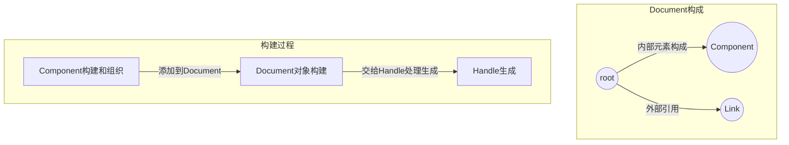

# JavaBoy-Core

**READ-ME**： [English](/README.md) | [中文](/README-zh.md)

---

## 页面的标准生成流程

```mermaid
graph
    subgraph Document构成
        r((root)) -- 内部元素构成 --> c((Component))
        r -- 外部引用 --> l((Link))
    end
    subgraph 构建过程
        Component构建和组织 -- 添加到Document --> Document对象构建 -- 交给Handle处理生成 --> Handle生成
    end

```

