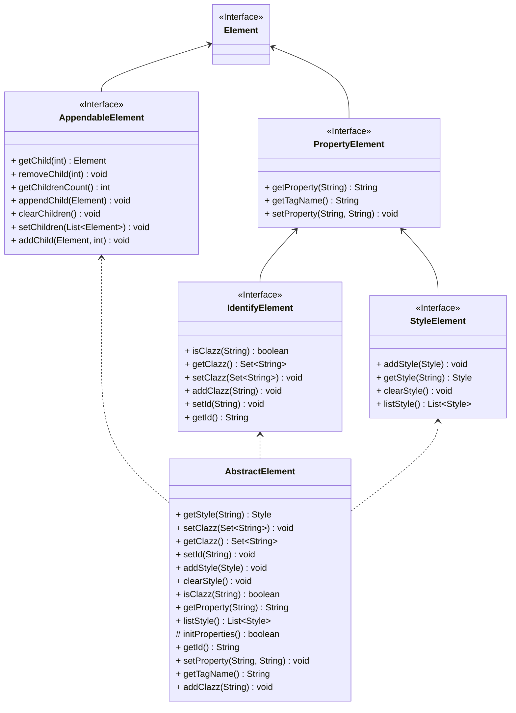

# JavaBoy

**READ-ME**：[English](/README.md) | [中文](/README-zh.md)

## 概述

**JavaBoy**是一个Java前端模板化界面以及前后端交互的开源框架。用户可以通过少量的Java代码来构建一个模板化的前端界面（如常用的关系系统，博客系统，表单系统等），**JavaBoy**还能够自动完成前后端交互代码，对于交互参数的自动解析，动态更新等功能。**JavaBoy**还同时支持引用外部**JavaScript、CSS**。

## 特色功能

1. 模板化的方式构建前端页面
2. 自动生成前后端交互脚本
3. 多主题适配
4. 自定义CSS
5. 简化更新
6. 不依赖平台，更加方便快捷，适用性很广

本项目是为了WEB项目构建，它不仅能够独立运行，将生成的前端项目生成导出，也能够作为依赖在项目中直接使用，我们主要构建了三个大模块

## 模块说明

- **JavaBoy-Core** ：**JavaBoy**项目的核心版本
- **JavaBoy-Web**：**JavaBoy**在常规项目中的依赖使用的模块
- **JavaBoy-Starter**：**JavaBoy**在**SpringBoot**中的使用的模块

## 运行环境

**JavaBoy**目前支持***Java8***以上的环境，不需要依赖其他环境依赖。

## 项目计划

1. 实现基本的HTML代码生成（通过Builder类）
2. 实现引用外部资源（JS、CSS等）
3. 实现前后端交互逻辑的代码生成
4. 实现样式的自定义（Java代码内）
5. 实现常用的JS代码
6. 实现自定义JS代码
7. 实现继承和注解的方式构建页面（不依赖Spring）
8. 适配SpringBoot
9. 结合Swagger实现拖拽方式构建页面并输出（类似于低代码平台）

## 与其他项目相比的特色
### 对于低代码平台
- 不依赖平台、开源，可独立运行
- 适应更多复杂的个性化需求
- 后续维护难度比低代码平台相对更低
### 相对于前端原生
- 无需接触大量的复杂的 CSS、HTML、JS 代码，可以用 Java 构建模板化前端页面
- 更适合后端程序员的轻量级独立开发
### 特色
- 非侵入式，开放，扩展性强
- 借助 Vue、React、Bootstrap 等前端框架生成代码（开发人员无需关心）

## 代码开发规范

合作开发的一些注意事项

- 只在自己的分支上提交代码

  ```c
  #include "stdio.h"
  
  
  ```

  

## 开发流程

项目的整体规划（开发步骤）

### 接口规定



